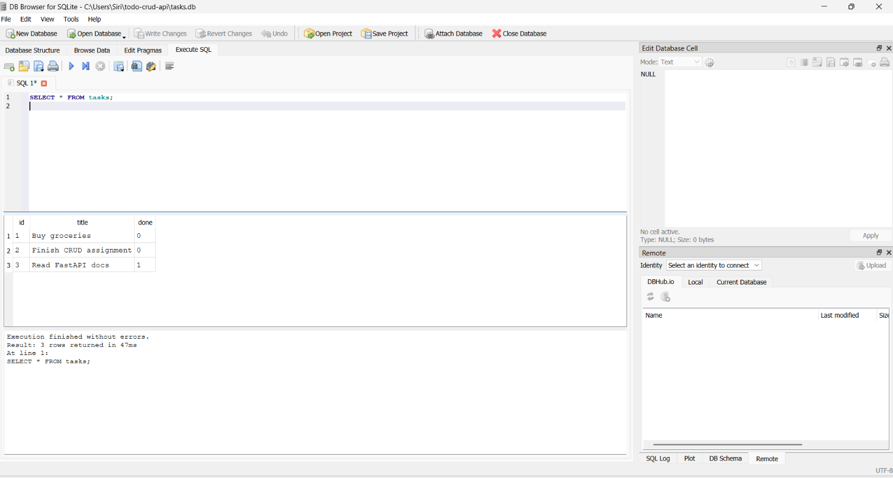

# Task API (SQLite version)

The same CRUD to-do API from Assignment 1 — now backed by a real **SQLite** database instead of an
in-memory Python list. Built with **FastAPI** for FlyRank's W3·A1 assignment.

The endpoints, request bodies, and responses are all identical to Assignment 1. Only the storage
layer changed: tasks are now saved in a `tasks.db` file, so they **survive a server restart**.

## Why SQLite

SQLite was chosen because it needs no separate database server or installation — it's a single
file (`tasks.db`) that Python's built-in `sqlite3` module can read and write directly. That makes
it perfect for a small project like this: zero setup, and anyone who clones the repo gets a working
database automatically the first time they run the app.

## Where the database file lives

`tasks.db` is created automatically in the project's root folder the first time you start the
server. It is *not* committed to Git (see `.gitignore`) — it's generated fresh on each machine that
runs the project, and the app seeds it with 3 example tasks only if the table is empty.

## How to run it

**Requirements:** Python 3.10+

```bash
pip install -r requirements.txt
uvicorn main:app --reload
```

The server starts at `http://localhost:8000`. The `tasks.db` file appears in the same folder
automatically — no manual setup needed.

- API root: http://localhost:8000/
- Swagger UI: http://localhost:8000/docs

## Endpoints

| Method | Path              | Description                                  | Success | Errors        |
|--------|-------------------|-----------------------------------------------|---------|---------------|
| GET    | `/`               | API info                                      | 200     | —             |
| GET    | `/health`         | Health check                                  | 200     | —             |
| GET    | `/tasks`          | List tasks (supports `?done=`, `?search=`, `?limit=`, `?offset=`) | 200 | — |
| GET    | `/tasks/{id}`     | Get a single task                             | 200     | 404 unknown id |
| POST   | `/tasks`          | Create a task (`{"title": "..."}`)            | 201     | 400 missing/empty title |
| PUT    | `/tasks/{id}`     | Update a task's title and/or done status      | 200     | 400 empty title · 404 unknown id |
| DELETE | `/tasks/{id}`     | Delete a task                                 | 204     | 404 unknown id |
| GET    | `/stats`          | Task counts, computed with SQL `COUNT()`      | 200     | —             |

## Example: full CRUD cycle with curl

```bash
# Create
curl -i -X POST http://localhost:8000/tasks -H "Content-Type: application/json" -d '{"title":"Buy milk"}'
```

```
HTTP/1.1 201 Created
content-type: application/json

{"id":4,"title":"Buy milk","done":false}
```

```bash
# Update, delete, verify 404, check stats
curl -i -X PUT http://localhost:8000/tasks/4 -H "Content-Type: application/json" -d '{"done":true}'
curl -i -X DELETE http://localhost:8000/tasks/4
curl -i http://localhost:8000/tasks/4
curl -i http://localhost:8000/stats
```

## Persistence check (the whole point of this assignment)

1. Start the server, create a task via `POST /tasks`.
2. Stop the server (`Ctrl+C`).
3. Start it again (`uvicorn main:app --reload`).
4. Run `GET /tasks` — the task you created is still there, and the 3 example tasks were **not**
   duplicated, because they're only inserted when the table is empty.

## Exploring the database directly

Open `tasks.db` with [DB Browser for SQLite](https://sqlitebrowser.org/) and try these queries:

```sql
SELECT * FROM tasks;
SELECT * FROM tasks WHERE done = 1;
SELECT COUNT(*) FROM tasks;
UPDATE tasks SET done = 1;
DELETE FROM tasks WHERE done = 1;
```

Any change made here shows up immediately the next time you call the API — proof that the API and
the database are two separate layers.

   

## Notes

- Validation is unchanged from Assignment 1: `POST`/`PUT` reject a missing or empty `title` with `400`.
- Filtering (`?done=`), search (`?search=`, via SQL `LIKE`), and pagination (`?limit=`/`?offset=`)
  are all done in SQL rather than in Python.
- `/stats` uses SQL's `COUNT()` instead of counting in Python.
